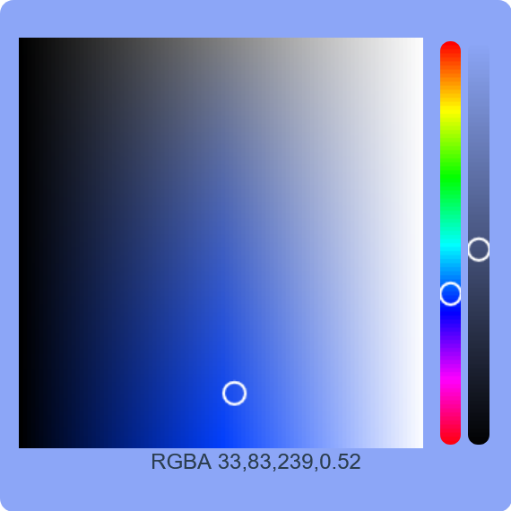

# ColorPick Vue 3

Este é um simples colorpicker feito usando Vue 3 no estilo da Option API. Com este colorpicker, é possível selecionar a cor desejada, incluindo o canal alfa, enquanto os parâmetros estão sendo ajustados. O valor RGBA correspondente é gerado e exibido no próprio componente para uso posterior.

## Demonstração



## Instalação

```bash
# Instale as dependências
npm install
# Ou use yarn
yarn install
```

## Uso

Após a instalação das dependências, você pode executar o servidor de desenvolvimento local com o seguinte comando:

```bash
# Com npm
npm run serve

# Ou com yarn
yarn serve
```

Isso iniciará um servidor local e você poderá acessar o colorpicker em seu navegador.

Certifique-se de verificar o arquivo `App.vue` para ver como o componente do colorpicker está sendo usado e ajustado.

## Contribuição

Sinta-se à vontade para abrir um pull request se desejar contribuir para este projeto. Seja claro ao descrever as mudanças propostas e certifique-se de testar adequadamente.

## Autor

### Paulo Ricardo Teixeira

#### Desenvolvedor

Linkedin: [linkedin.com/in/paulo-ricardo-teixeira/](https://www.linkedin.com/in/paulo-ricardo-teixeira/)

## Licença

Este projeto é licenciado sob a Licença MIT - veja o [MIT](https://choosealicense.com/licenses/mit/) para mais detalhes.
